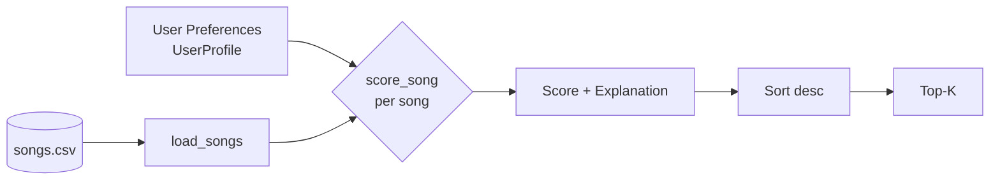
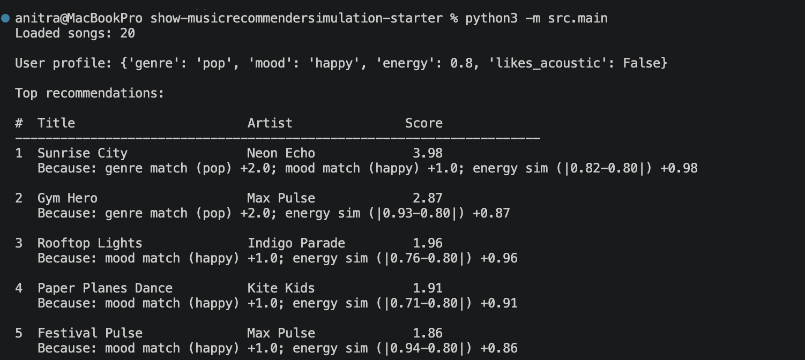

# 🎵 Music Recommender Simulation

## Project Summary

In this project you will build and explain a small music recommender system.

Your goal is to:

- Represent songs and a user "taste profile" as data
- Design a scoring rule that turns that data into recommendations
- Evaluate what your system gets right and wrong
- Reflect on how this mirrors real world AI recommenders

Replace this paragraph with your own summary of what your version does.

---

## How The System Works

Real-world platforms like Spotify and YouTube predict what you'll love next by blending two main approaches. **Collaborative filtering** looks at other users' behavior. If people with listening history similar to yours loved a song, it recommends that song to you, even without knowing anything about the audio itself. **Content-based filtering** instead looks at the attributes of the songs themselves (genre, tempo, mood, acousticness) and recommends songs whose features match your taste profile. Most production systems combine both, plus signals like likes, skips, playlist adds, and completion rate, and feed them into large machine learning models trained on billions of interactions.

My simulation is a small **content-based recommender**. It has no other users to learn from, so it scores each song by how closely its attributes match a single user's stated preferences. The system prioritizes **vibe matching**, rewarding songs whose energy and valence are *close* to the user's target (not just high or low), and giving bonus points for matching the preferred genre and mood.

### Features Used

**`Song` attributes** (from `data/songs.csv`):
- `genre` (categorical) — e.g. pop, lofi, rock, jazz
- `mood` (categorical) — e.g. happy, chill, intense, focused
- `energy` (0.0–1.0) — how energetic the track feels
- `valence` (0.0–1.0) — how positive / happy it sounds
- `tempo_bpm` — beats per minute
- `danceability`, `acousticness` — secondary vibe signals

**`UserProfile` stores**:
- `preferred_genre` and `preferred_mood` (categorical targets)
- `target_energy` and `target_valence` (numeric targets on 0.0–1.0)

### Scoring vs. Ranking

The **Scoring Rule** rates one song against the user: categorical matches (genre, mood) add fixed weighted points, and numerical features contribute `1 - |song.value - user.target|` so songs *closer* to the target score higher. The **Ranking Rule** then sorts every song in the catalog by that score and returns the top N (scoring judges individual fit, ranking turns that into an ordered recommendation list).

### Example User Profile — "VibeFinder Default"

```python
UserProfile(
    favorite_genre="lofi",
    favorite_mood="chill",
    target_energy=0.40,
    likes_acoustic=True,
)
```

This profile describes a listener who wants low-energy, acoustic, chill lofi — the opposite end of the catalog from "intense rock." Pinning both a categorical tag (`lofi` / `chill`) *and* a numeric target (`energy ≈ 0.4`) pulls Midnight Coding and Library Rain to the top while pushing Storm Runner and Gym Hero to the bottom. A profile with only `favorite_genre` would be too narrow; `target_energy` lets the system differentiate "chill lofi" from "hyperpop-lofi" within one genre.

### Algorithm Recipe (Finalized Weights)

| Signal | Weight | Formula |
| --- | --- | --- |
| Genre match | **+2.0** | `song.genre == user.favorite_genre` |
| Mood match | **+1.0** | `song.mood == user.favorite_mood` |
| Energy similarity | **+1.0 × sim** | `1 - abs(song.energy - user.target_energy)` |
| Acoustic bonus | **+0.5** | if `user.likes_acoustic` and `song.acousticness > 0.7` |

Ties break by song id. Top-K (default K=5) are returned.

### Data Flow



### Expected Biases

- **Genre dominance.** At +2.0, a genre match almost always beats a better mood+energy fit from a different genre — a perfect-vibe jazz song loses to a mediocre lofi one for a lofi user.
- **Popular-category bias.** Genres overrepresented in `songs.csv` (lofi, pop) match more users by chance; rare genres (folk, r&b, punk) are structurally disadvantaged.
- **Midpoint bias.** Songs with `energy ≈ 0.5` score decently against any target, so "average" tracks surface more than they should.
- **No diversity penalty.** Top-K can be near-duplicates (three LoRoom tracks) — the ranker never penalizes similarity *between* recommendations.

---

## Getting Started

### Setup

1. Create a virtual environment (optional but recommended):

   ```bash
   python -m venv .venv
   source .venv/bin/activate      # Mac or Linux
   .venv\Scripts\activate         # Windows

2. Install dependencies

```bash
pip install -r requirements.txt
```

3. Run the app:

```bash
python -m src.main
```

### Running Tests

Run the starter tests with:

```bash
pytest
```

You can add more tests in `tests/test_recommender.py`.

---

## CLI Output

Running `python -m src.main` with the default `pop / happy / energy=0.8` profile:



---

## Experiments You Tried

Use this section to document the experiments you ran. For example:

- What happened when you changed the weight on genre from 2.0 to 0.5
- What happened when you added tempo or valence to the score
- How did your system behave for different types of users

---

## Limitations and Risks

Summarize some limitations of your recommender.

Examples:

- It only works on a tiny catalog
- It does not understand lyrics or language
- It might over favor one genre or mood

You will go deeper on this in your model card.

---

## Reflection

Read and complete `model_card.md`:

[**Model Card**](model_card.md)

Write 1 to 2 paragraphs here about what you learned:

- about how recommenders turn data into predictions
- about where bias or unfairness could show up in systems like this


---

## 7. `model_card_template.md`

Combines reflection and model card framing from the Module 3 guidance. :contentReference[oaicite:2]{index=2}  

```markdown
# 🎧 Model Card - Music Recommender Simulation

## 1. Model Name

Give your recommender a name, for example:

> VibeFinder 1.0

---

## 2. Intended Use

- What is this system trying to do
- Who is it for

Example:

> This model suggests 3 to 5 songs from a small catalog based on a user's preferred genre, mood, and energy level. It is for classroom exploration only, not for real users.

---

## 3. How It Works (Short Explanation)

Describe your scoring logic in plain language.

- What features of each song does it consider
- What information about the user does it use
- How does it turn those into a number

Try to avoid code in this section, treat it like an explanation to a non programmer.

---

## 4. Data

Describe your dataset.

- How many songs are in `data/songs.csv`
- Did you add or remove any songs
- What kinds of genres or moods are represented
- Whose taste does this data mostly reflect

---

## 5. Strengths

Where does your recommender work well

You can think about:
- Situations where the top results "felt right"
- Particular user profiles it served well
- Simplicity or transparency benefits

---

## 6. Limitations and Bias

Where does your recommender struggle

Some prompts:
- Does it ignore some genres or moods
- Does it treat all users as if they have the same taste shape
- Is it biased toward high energy or one genre by default
- How could this be unfair if used in a real product

---

## 7. Evaluation

How did you check your system

Examples:
- You tried multiple user profiles and wrote down whether the results matched your expectations
- You compared your simulation to what a real app like Spotify or YouTube tends to recommend
- You wrote tests for your scoring logic

You do not need a numeric metric, but if you used one, explain what it measures.

---

## 8. Future Work

If you had more time, how would you improve this recommender

Examples:

- Add support for multiple users and "group vibe" recommendations
- Balance diversity of songs instead of always picking the closest match
- Use more features, like tempo ranges or lyric themes

---

## 9. Personal Reflection

A few sentences about what you learned:

- What surprised you about how your system behaved
- How did building this change how you think about real music recommenders
- Where do you think human judgment still matters, even if the model seems "smart"

